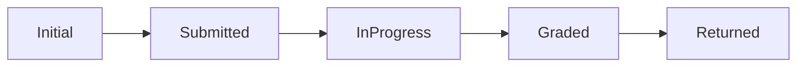

# Project Overview: "GradeFast"

**Terse Description:**

"GradeFast" is a Python web app designed to expedite grading in educational settings. It tracks assignment grading times and identifies the top 3 fastest graders. The project, at the API decision stage, will be a client-server system for mobile and limited-resource wearables. In the Chief Architect's absence, you're tasked with completing the backend Proof-of-Concept, focusing on code quality and documentation. The existing tests are immutable. Business logic implementation is deferred to the front-end team.

## Graph Diagram

**Notes**: `Assignment` should initialize `current_state` to `Initial`.

## Implementation Details

1. **State Pattern Classes**: Implement `Submitted`, `InProgress`, and `Graded` classes to model the grading process states, tracked in `Assignment`.

2. **Graph Traversal for Grading Time**: Use the `Node` and `Edge` classes in `Assignment` to calculate grading turnaround times, and identify the top 3 teachers based on the shortest grading times.

3. **CI/CD Pipeline with GitHub Actions**:
   - **Continuous Integration (CI)**: Set up GitHub Actions to run PyTest, ensuring all unit tests pass on each push.
   - **Continuous Deployment (CD)**: Create a GitHub Action to build the program into a Python 3.10 wheel, available for download upon successful CI completion.

4. **Documentation**: All Python functions and classes must include comprehensive Google-style docstrings and appropriate PEP526 annotations.

## Testing and Documentation

- **Unit Testing**: Write comprehensive tests for each component.
- **Docstrings and Annotations**: Ensure all code includes Google-style docstrings and Python type annotations for clarity and maintainability.

## Rubric

### Implementation Details

1. **State Pattern Classes (30 points)**
   - **Correct Implementation (10 points)**
   - **Transition Logic (10 points)**
   - **Code Berevity (10 points)**

2. **Graph Traversal for Grading Time (40 points)**
   - **Non-Recursive Correct Implementation of `Assignment` (30 points)**
   - **Data Frame Creation and Analysis (5 points)**
   - **Result Accuracy (5 points)**

3. **CI/CD Pipeline with GitHub Actions (20 points)**
   - **CI Configuration (10 points)**
   - **CD Configuration (10 points)**

### Testing and Documentation

1. **Unit Testing (10 points)**
   - **Coverage (5 points)**
   - **Correctness (5 points)**

2. **Docstrings and Annotations (10 points)**
   - **Google-Style Docstrings (5 points)**
   - **Type Annotations (3 points)**
   - **Readability and Consistency (2 points)**

### Overall Scoring

- Total points available: 100.
- Points distributed based on complexity and importance.
- Partial credit can be awarded in each section.
